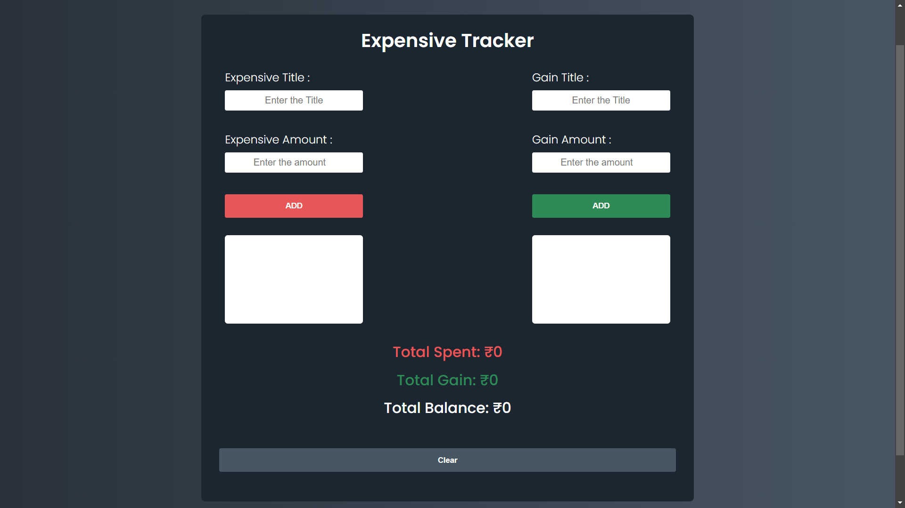
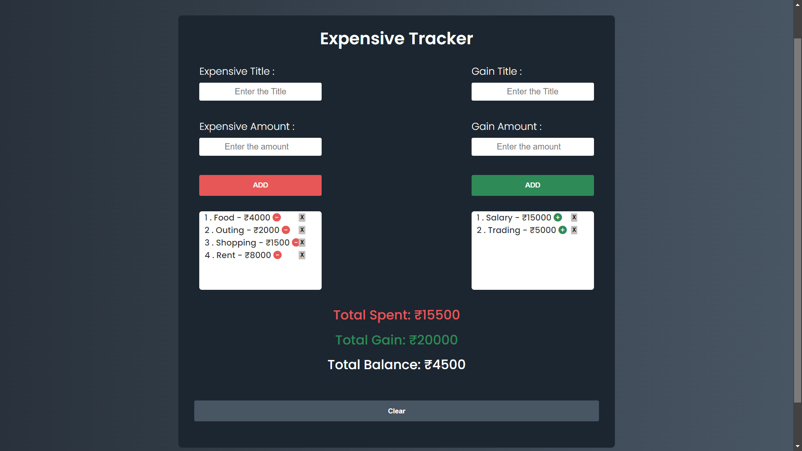

# ExpenseMate

**ExpenseMate** is a web application designed to help users track their expenses and gains. With a user-friendly interface, it allows you to manage and monitor your financial activities, ensuring you stay on top of your budget.

## Screenshots

### Screenshot-1



### Screenshot-2



## Features

- **Add and Track Expenses**: Input expense titles and amounts, view them listed, and see the total spent.
- **Add and Track Gains**: Input gain titles and amounts, view them listed, and see the total gained.
- **View Totals**: Automatically calculates and displays the total spent, total gained, and the balance.
- **Delete Entries**: Remove any expense or gain entry by clicking the delete button next to each item.
- **Clear All**: Clear all entries with a single click to reset the application.

## Technologies Used

- **HTML**: Structure of the web application.
- **CSS**: Styling of the web application.
- **JavaScript**: Functionality for adding, deleting, and calculating entries.
- **Local Storage**: Persistence of expense and gain data across sessions.

## Getting Started

### Prerequisites

- A modern web browser (Chrome, Firefox, Safari, etc.)

### Installation

1. Clone the repository:
   ```bash
   git clone <repository-url>
